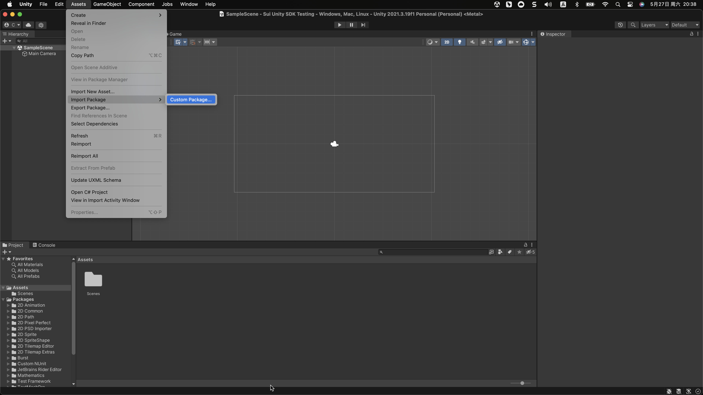
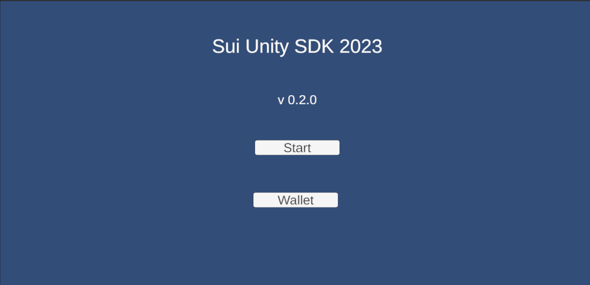

# SUI Unity SDK

[](https://github.com/CSzLong/sui-unity_sdk/releases/tag/v0.1.0)

## How to integrate Sui Unity SDK into Unity?

1. Download the latest version of the `Sui Unity SDK 2023` file `sui-unity-sdk.unitypackage` from releases of this repository:.

   https://github.com/CSzLong/sui-unity_sdk/releases

2. Import Sui Unity SDK into your Unity project:<br/>
   Navigation: **Assets -> Import Package -> Custom Package** <br/>
   
   select the downloaded `Sui Unity SDK 2023` package.

3. Set up the Unity scene to work with the Sui SDK.<br/>
   You can do this by adding the **`SuiCanvas`** prefab to your scene. 
   This prefab contains a canvas and a script that initializes the Sui SDK.

4. Involve class **`SuiManager`** from `Sui Unity SDK 2023` to initialize Sui SDK and set up any necessary configurations in your script.

For a more detailed explanation, including sample code, please refer to the documentation provided by Sui in the SDK package or on their website.


### Key Features

1. Backend and frontend separation functionality

2. Data upload functionality

3. Data retrieval functionality

4. Event reporting

5. Custom UI component library

- What should be noted?

## When using the Sui Unity SDK, please note the following:

1. Make sure you have imported the SDK correctly and follow the usage instructions provided in the Sui documentation.

2. Before using the SDK, please read the documentation to ensure that you are familiar with all the features and requirements of the SDK.

3. Be careful that do not to leak sensitive data and consider checking and deleting all code or information that may contain sensitive data before publishing.


## Examples

The code examples for using RPCs in Unity depend on which RPC library you choose to use. Here are two examples that may be helpful:

1. Photon Unity Networking（PUN）

```c#
using Photon.Pun;
using UnityEngine;

public class SomeScript : MonoBehaviourPun
{
[PunRPC]
void SomeRPCFunction(string someParameter)
{
Debug.Log("Received RPC with parameter: " + someParameter);
}

    void CallRPC()
    {
        photonView.RPC("SomeRPCFunction", RpcTarget.All, "someParameter");
    }
}
```

In this example, we define an RPC function called **`SomeRPCFunction`** and call it in the **`CallRPC`** function. The function has a string parameter that will be passed to other clients when the function is called. When calling the RPC, we use the **`photonView.RPC`** function and set the target to **`RpcTarget.All`** (send the RPC to all clients).


```c#
using Mirror;
using UnityEngine;

public class SomeScript : NetworkBehaviour
{
[TargetRpc]
void RpcSomeFunction(NetworkConnection target, string someParameter)
{
Debug.Log("Received RPC with parameter: " + someParameter);
}

    void CallRPC()
    {
        RpcSomeFunction(connectionToServer, "someParameter");
    }
}
```

In this example, we define an RPC function called **`RpcSomeFunction`** and call it in the **`CallRPC`** function. The function has a string parameter that will be passed to the server when the function is called, and will be sent to the target client via the **`target`** parameter. When calling the RPC, we use the **`RpcSomeFunction`** function and set the target to the connection of the client we want to send the RPC to.

Please note that these examples are conceptual proof-of-concepts and should not be copy-pasted directly into your code. You should modify these examples to suit your specific needs in order to use RPCs correctly in your project.

## Demo UI

